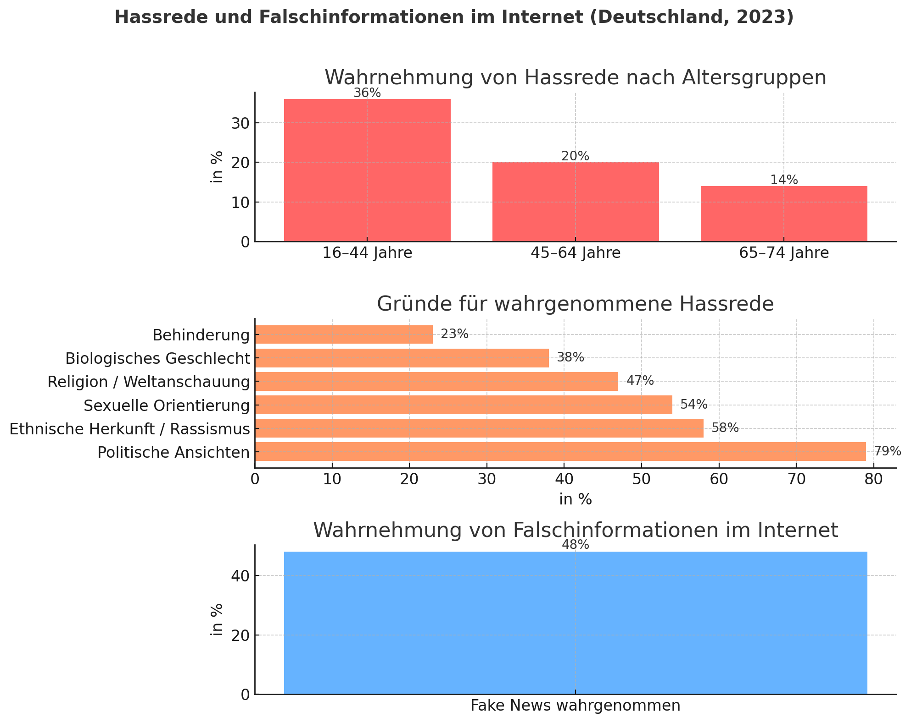

# deutschlandfunk.de - Wie Social Bots Falschmeldungen verbreiten
- Was sind Social Bots?
    * Computerprogramme, die autonom Aufgaben erfüllen (Beiträge teilen, etc.)
- Reale Follower 
    * bestärkt "Echtheit" der Bots
- Bots vs. Bots und Hass 
    * Der Kampf gegen Bots und Hass im Netz wird teilweise auch von Bots geführt, welche die Hassverbreitenden Menschen anschreibt mit Selbsthilfe Tipps und Videos, um sich wieder nützlich zu machen in der Gesellschaft. (Ethical Hacking?)
- Nachrichten müssen Viral gehen 
    * Emotionale Fake News, falsche Zitate
- Analysen von Facebook-Daten (unter anderem) aus dem US-Wahlkamp zeigen, dass Falschmeldungen sich schneller verbreiten als faktisch geprüfte Inhalte durch Journalisten
- Fake Follower für Politiker, Hashtags(Schlagwörter) um falsche Eindrücke zu schaffen
- Verschiedene Berater haben unterschiedliche Meinungen zu der Beeinträchtigung in Wahlkämpfen durch Bots

# lmu.de (Ludwig-Maximilians-Universität München)
- traditionelle Medien hatten ein Monopol, heute sind es Social Media und andere Platformen
    * Aufbrechen des Monopols ist gut, aber auch problematisch
- Reichweite und Sehdauer sind wichtige Faktoren
- Medienkompetenz in Schulen ist nicht leicht umzusetzen
    * Lehrer sind nicht gut genug gerüstet
        * Weiterbildungsprogramme von externen Anbietern
        * Initiativen sind oft symbolischer Natur (Medienführerschein in Bayern) dessen nutzen unklar sind.
    * Medienkompetenz allein läst keine Probleme
        * Auch Extremisten sind Medienkompetent, Medienkompetenz und Demokratieerziehung sollten kombiniert werden

> Gerade auch ältere Zielgruppen, die das Netz in den letzten Jahren, verstärkt während der Corona-Pandemie, zu nutzen gelernt haben, sind anfällig [für Desinformation]

* außerhalb Deutschlands aber auch innerhalb werden Desinformationen verbreitet
    * meist mit Ängsten, Emotionalen Schlagzeilen und Diskreditieren der traditionellen Medien
* Desinformation kursiert innerhalb bestimmter Gruppen
* KI bringt neue Herausforderungen
    * Taugesschausprecher tauchten in gefälschten Videos auf
        - Eine weitere Möglichkeit, auch die traditionellen Medien zu diskreditieren und zu infiltrieren
* Das Alter ist weniger entscheidend über die Anfälligkeit von Desinformation
    * Gerade Menschen die bereits eine vorgeprägte Meinung oder starkes Interesse haben, sind mit höherer Wahrscheinlichkeit Fehlinformationen ausgesetzt
* Algorithmen der Plattformen führt zur Bildung von Informationsblasen, die das Weltbild bestätigen
    * Sucht auf Platform "Erde ist flach" -> schaut Video an -> überzeugt -> schaut mehr Videos an -> Algorithmus merkt sich das und spült mehr solcher Videos in das Feed.
* Plattformen sind nicht transparent
* Neue Regulation von Medien
    * Behörden greifen erst bei bestimmten Schwellenwerten ein aufgrund der Historie
    * Vorschlag: Monitoring-System für mehr gesellschaftliche Transparenz

# MDR: Fake News: Social Media macht Meinungsmache und Manipulation einfach
Interview einer Forschungsgruppe an Fraunhofer FKIE in Bonn
- Propaganda und die Manipulation sind keine Erfindung des Internetzeitalters, sie optimal zu verschleiern hingegen schon
- Fake News sind nicht mehr zu erkennen
- Software beobachtet Verhalten und Statistiken(Likes, Shares, Kommentare) von Social Media posts 
    * Manipulation ist einfach zu erkennen für die Software, jedoch nicht für normale Nutzer
- Die Analyse der Forschungsgruppe zeigt ganz klar, dass Social Media verwendet wird um die öffentliche Meinung zu manipulieren
- manipulative Argumentationstechniken sind noch schwerer zu erkennen als Falschmeldungen
    * "falsche Dilemma" -> Dabei werden Entscheidungsoptionen auf zwei Extreme reduziert, in der Hoffnung, dass die eigene Position als die vermeintlich bessere wahrgenommen werde.
    * Mittelwege werden bei solchen Diskussionen außer Acht gelassen.
- Kritik an Personen des öffentlichen Lebens geschieht oft nicht sachlich, sondern persönlich.

Christian Schlereth von der WHU:  
> Skeptisch sollten Leser werden, wenn sie sich von einer Aussage oder Nachricht vorwiegend auf einer emotionalen und nicht auf einer sachlichen Ebene angesprochen fühlen.

# Statisik vom Statistischem Bundesamt

# Quellen:
- [Deutschlandfunk](https://www.deutschlandfunk.de/meinungsmache-im-netz-wie-social-bots-falschmeldungen-100.html)
- [LMU](https://www.lmu.de/de/newsroom/newsuebersicht/news/wer-sind-die-meinungsmacher.html)
- [MDR](https://www.mdr.de/wissen/fake-news-social-media-macht-meinungsmache-und-manipulation-einfach100.html)
- [Statistisches Bundesamt](https://www.destatis.de/DE/Presse/Pressemitteilungen/2023/12/PD23_470_63.html)

# Folie 1:
## Meinungsmache im Netz
### Überschrift: Warum Medienkompetenz eine Schlüsselkompetenz ist

- Christian Döhmann
- Deutsch
- 03.11.2025

# Folie 2:
### Überschrift: Informationsflut & Manipulation im Netz
- Täglich konsumieren Menschen unzählige Informationen online, gerade Jugendliche sind davon betroffen
- Fake News, Filterblasen und Algorithmen beeinflussen Meinungen
- Der Unterschied zwischen echten und falschen Inhalten wird immer schwerer zu unterscheiden
* Medienkompetenz wird immer wichtiger  
-> Grafik (Fakten vs. Meinung)

# Folie 3:
### Überschrift: Wie stark sind Jugendliche betroffen?
- Fake News, % an Jugendlichen die auf Fake News gestoßen sind
- % die sich zutrauen, diese sicher zu erkennen
* Grafik(Statistik + Quelle)

# Folie 4:
## Begriffserklärung: Meinungsmache & Desinformation
### Überschrift: Was ist Meinungsmache im Netz?
- Gezielte Beeinflussung der öffentlichen Meinung
- Einsatz von Fake News, emotionalen Inhalten & Bots
- Algorithmen bevorzugen extreme oder empörende Beiträge (* höhe Klickzahlen)
- Folge: Polarisierung & verzerrte Warhnung der Realität
* Grafik(Fake News Schlagzeilen | Varoufakis?)

# Folie 5:
### Überschrift: Medienkompetenz = Schlüsselkompetenz
- Fähigkeit, Medien kritisch, kreativ und sicher zu nutzen
- Erkennen von Manipulation, Falschmeldungen & Quellenbewertung
- Verantwortungsvoller Umgang mit eigenen Beiträgen (Selber keine Fake News verbreiten/teilen)
- Unverzichtbar für Demokratie & Meinungsfreiheit

# Folie 6:
### Überschrift: Wie weit sind Schulen wirklich?
- Nur ca. 50% der Schulen behandeln Medienbildung regelmäßig
- Lehrkräfte oft nicht ausreichend geschult
- Schüler wünschen sich mehr praxisnahe Projekte

# Folie 7:
### Überschrift: Manipulation im Netz erkennen
- Wie funktionieren Fake News & Filterblasen?
- Warum teilen Menschen Falschmeldungen?
- Psychologische Tricks: Emotion statt Information

* Schüler lernen, Quellen zu prüfen & gegenzurecherchieren
# Folie 8:
### Überschrift: Medienkompetenz in der Schule fördern
- Unterrichtsfächer mit Medienprojekten verknüpfen
- Reale Beispiele aus TikTok, Instagram oder YouTube analysieren
- Kritische Diskussion über Einfluss und Verantwortung

* Schüler werden zu reflektierten Mediennutzern

# Folie 9:
### Überschrift: Gesellschaftliche Verantwortung
- Plattformen müssen transparenter werden (Algorithmen, Kennzeichnung)
- Politik und Schulen sollen Aufklärung fördern
- Jeder Einzelne trägt Verantwortung für das, was er teil

> Nicht alles, was viral geht, ist wahr.

# Folie 10:
### Ideen zur Verbesserung
1. Unterrichtsprojekte
- Schüler erstellen selbst Fake News * lernen Manipulation zu erkennen

2. Workshops
- Kooperation mit Journalisten / Medienanstalten

3. Digitalkompetenz als Pflichtfach
- Medienbildung fächerübergreifend und praxisnah

4. Peer-Projekte
- Ältere Schüler erklären jüngeren den sicheren Umgang mit Medien

# Folie 11:
### Fazit:
- Meinungsmache betrifft alle, besonders Jugendliche
- Medienkompetenz schützt vor Manipulation 
- Schulen spielen eine entscheidende Rolle
- Kritisches Denken = beste Waffe gegen Desinformationen
